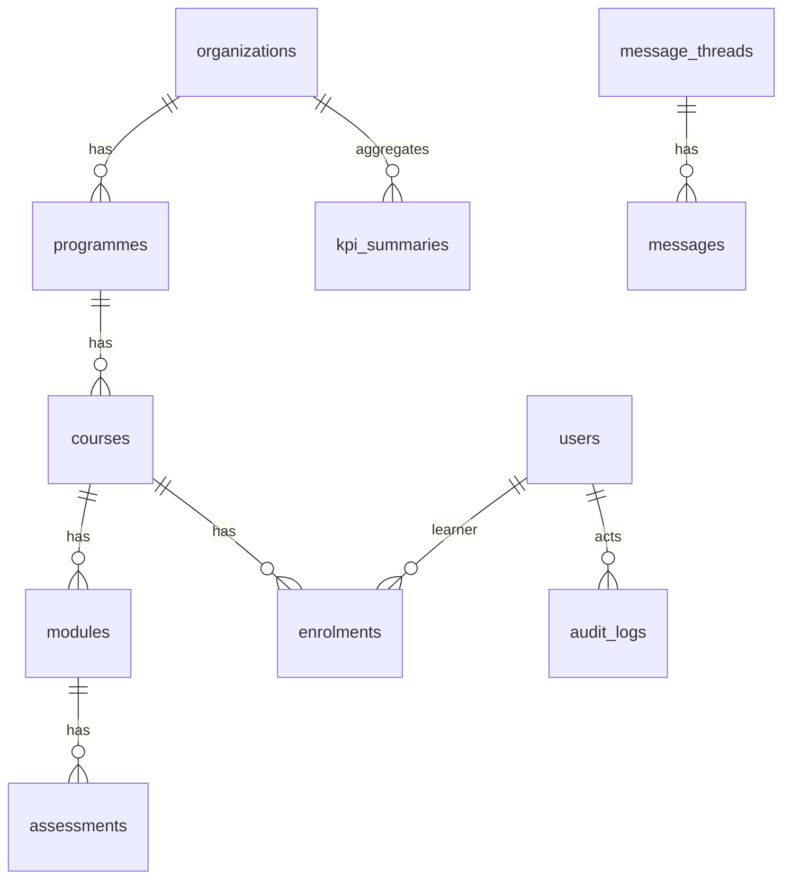

# Architecture

```mermaid
erDiagram
  organizations ||--o{ programmes : has
  programmes ||--o{ courses : has
  courses ||--o{ modules : has
  modules ||--o{ assessments : has
  courses ||--o{ enrolments : has
  users ||--o{ enrolments : learner
  message_threads ||--o{ messages : has
  organizations ||--o{ kpi_summaries : aggregates
  users ||--o{ audit_logs : acts
```

Services: reviewCredit (formula s7.1), nudge (calendar gaps), kpiJob (nightly).
Auth: JWT + SSO exchange. RBAC per programme. Audit middleware logs mutations.

